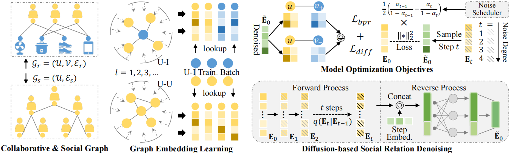

# Denoised Social Recommender via Diffusion Model (SDR)
This is the PyTorch-based implementation for DSL model proposed in this paper:
>Denoised Social Recommender via Diffusion Model

## Abstract
Social recommendation has emerged as a valuable means to improve personalized recommendation for its strength to enhance user representation learning by leveraging the social connections among users, such as following and friend relations observed in online social platforms. The key assumption of social recommendation is the homophily in preference patterns for socially-connected users. That is, users connected by social ties share similar taste in user-item activities such as rating and purchasing. However, this assumption does not always hold due to the presence of irrelevant and false social ties, which can instead pollute the user embeddings and harm the recommendation accuracy.
To address this issue, we propose a novel diffusion-based social denoising framework, called Social Diffusion-based Recommender model. A simple yet effective hidden-space diffusion is designed for noise removal in the compressed and dense representation space. Through the multi-step noise diffusion and removal, our model is endowed with a strong noise identification and elimination ability for the encoded user representations with different noise degrees. The diffusion module is optimized in a downstream task-aware manner to maximally facilitate the recommendation target.
Extensive experiments have been conducted for evaluating the efficacy of this framework. Results demonstrate its superiority in recommendation accuracy, training efficiency, and denoising effectiveness.
## Environment
- python=3.8
- torch=1.12.1
- numpy=1.23.1
- scipy=1.9.1
- dgl=1.0.2+cu113
## Datasets
Our experiments are conducted on three benchmark datasets collected from Ciao, Epinions and Yelp online platforms. In those sites, social connections can be established among users in addition to their observed implicit feedback (e.g., rating, click) over different items.

| Dataset  | # Users | # Items | # Interactions | # Social Ties |
| :------: | :-----: | :-----: | :------------: | :-----------: |
|   Ciao   |  1,925  | 1,5053  |     30,370     |     65,084    |
| Epinions | 14,680  | 233,261 |    447,312     |    316,291    |
|   Yelp   |  99,262 | 251,722 |    715,821     |   1,298,522   |
## Usage

Please unzip the datasets first. Also you need to create the `History/`+'dataset_name (e.g,ciao)' and the `Models/`+ 'dataset_name (e.g,ciao)' directories. The command lines to train SDR on the three datasets are as below. The hyperparameters in the commands are set as default.

- Ciao

  ```shell
  bash scripts/run_ciao.sh
  ```

- Epinions

  ```shell
  bash scripts/run_epinions.sh
  ```

- Yelp

  ```shell
  bash scripts/run_yelp.sh
  ```
